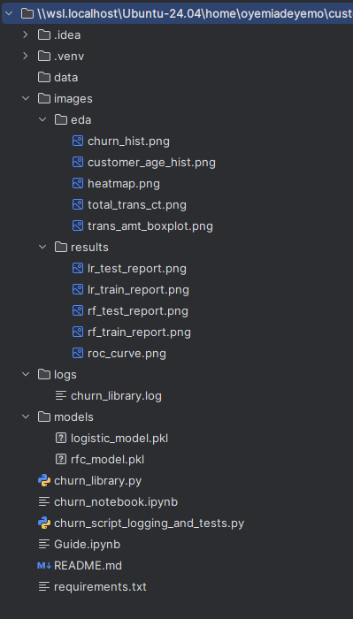

## 🧠 Predict Customer Churn
A machine learning pipeline for identifying potential customer churn, developed as part of the ML DevOps Engineer Nanodegree from Udacity.

## 📌 Project Description
This project builds a machine learning workflow to predict customer churn for a fictional bank. The pipeline includes data ingestion, exploratory data analysis (EDA), feature engineering, model training, evaluation, and deployment of models via serialized objects. The workflow is supported by test-driven development and logging for transparency and reproducibility.

## 📁 Files and Data Description
Root Structure:
customer_churn_eda/

data/
        bank_data.csv                   # Input dataset

    images/
        eda/                            # EDA visualizations
        results/                        # Model evaluation results (e.g., ROC curves)

    logs/
        churn_library.log               # Log file capturing pipeline activity

    models/
        logistic_model.pkl              # Trained Logistic Regression model
        rfc_model.pkl                   # Trained Random Forest Classifier

    churn_library.py                    # Core pipeline code: EDA, feature engineering, modeling
    churn_script_logging_and_tests.py  # Testing + logging script for reproducibility
    README.md                           # Project documentation
    requirements.txt                    # Project dependencies

## ⚙️ Running Files
### 1. Run Main Pipeline
To execute the full pipeline:

python churn_script_logging_and_tests.py

This will:

- Import and clean data
- Generate EDA plots in images/eda/
- Perform feature engineering
- Train and evaluate models
- Save models in models/
- Log all steps to logs/churn_library.log
- Save ROC curves and evaluation metrics in images/results/

### 2. Run Individual Modules
You may also import and call functions from churn_library.py directly for modular experimentation.

## 🧪 Testing
The script churn_script_logging_and_tests.py includes test functions for:

- Data import
- EDA generation
- Encoding helpers
- Feature engineering
- Model training
- Assertions ensure the correctness of key pipeline components.